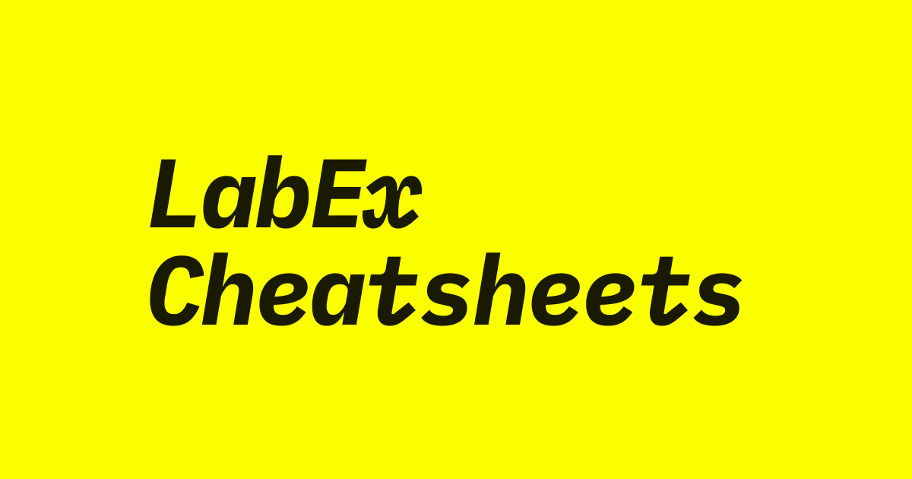

<h1 align="center">LabEx Cheatsheets</h1>

  Cheatsheets for Programming Beginners

  <a href="https://labex.io/cheatsheets">labex.io/cheatsheets</a>

LabEx Cheatsheets is a comprehensive technical reference platform covering multiple technology domains. Whether you're working with Linux, DevOps, Cybersecurity, Databases, Data Science, Cloud platforms, or programming languages, our cheatsheets provide quick reference guides for developers and IT professionals of all skill levels.

From system administration to web development, from security tools to data analysis libraries, LabEx Cheatsheets helps you quickly find the information you need without interrupting your workflow.

## Quick Links

- **[View on GitHub](https://github.com/labex-labs/labex-cheatsheets)**: Drop a star on GitHub if you find this project useful

## License

Content is licensed under [MIT](https://opensource.org/licenses/MIT) and maintained by the [LabEx](https://labex.io/) team.
